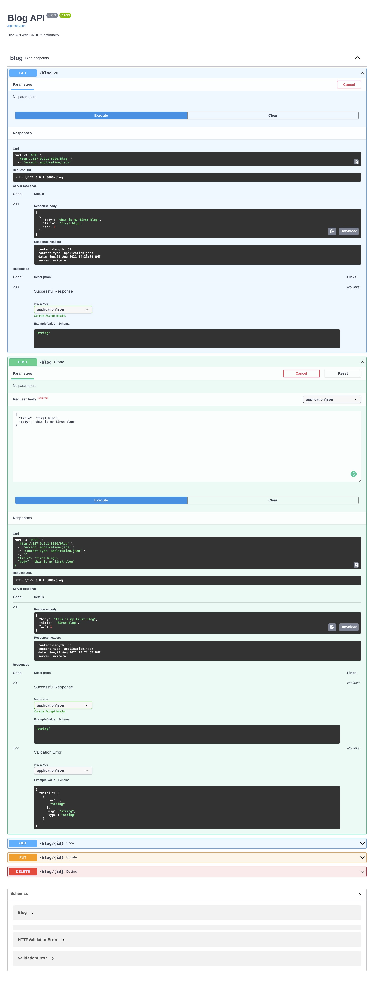

## Basic Blog API built with FAST API Framework

### Functionality

- Create : _create new blog_
- Read : _read all blogs or single instance_
- Update : _Update blog_
- Delete : _destroy blog_

### Database used

> This is basic API so I have used **SQLite3** database. Feel free to use any database you like.
> To know more about which are the database FAST API support [click here](https://fastapi.tiangolo.com/tutorial/sql-databases/?h=database)

### how to run locally

1. Clone the repo

```shell
git clone https://github.com/Sachin-chaurasiya/FastAPI.git
```

2. Create virtual environment

```shell
python3 -m venv env
```

3. Activate vertual environment

```shell
source env/bin/activate
```

4. Install dependencies

```shell
pip3 install -r requirements.txt
```

5. Start the server

```shell
uvicorn blog.main:app --reload
```

Now your project is running locally
open your browser and visit [localhost:8000](http://localhost:8000)

### screenshots



`Thank you`
